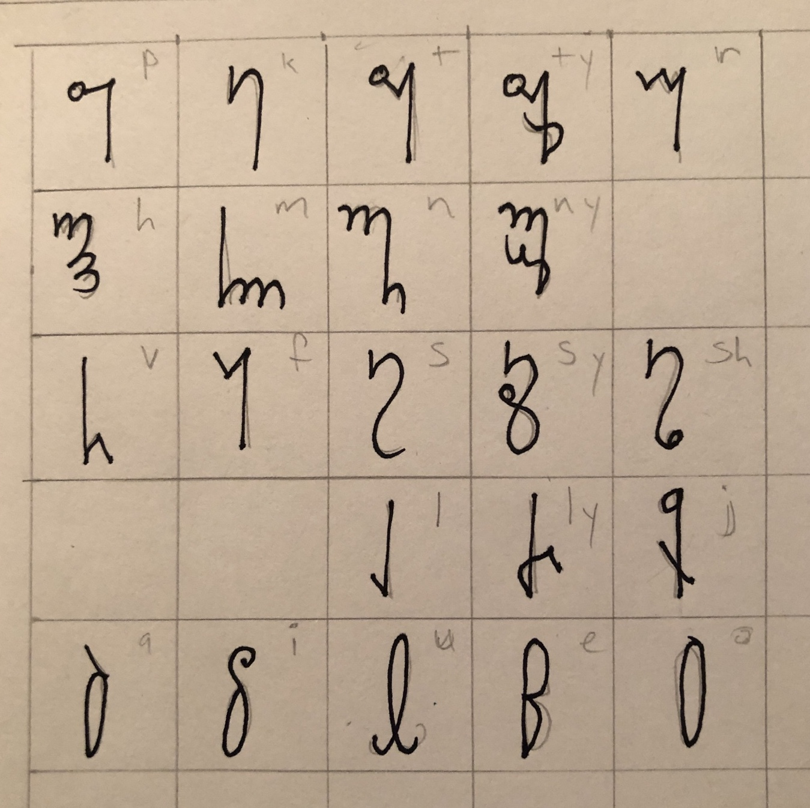

### Script

The script is based on the [Theban alphabet](https://www.omniglot.com/conscripts/theban.htm) with a few changes and additions. I've always liked the look of this script, so I'm using it. 

Vowels: Rounded closed shapes

Voiced consonants: written at bottom of stem

Voiceless consonants: written at top of stem

Palatalized consonants: tail crosses over stem

TODO: some notes about the latin orthography
